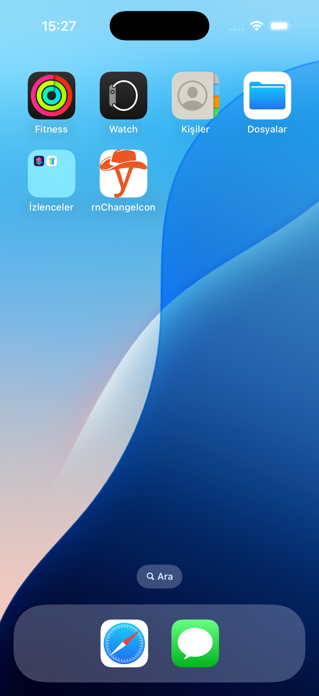

[](https://badge.fury.io/js/react-native-app-icon-changer)


# React Native App Icon Changer Setup

`react-native-app-icon-changer` is a powerful and easy-to-use library that allows you to dynamically manage app icons in your React Native projects. It supports both iOS and Android platforms, enabling seamless switching between multiple app icons without requiring manual intervention or complex configuration. Whether you want to personalize your app's appearance or highlight special events, this library simplifies the entire process.

With `react-native-app-icon-changer`, you can dynamically change your app's icon during runtime. The package handles all necessary platform-specific configurations, ensuring a smooth integration process. Its primary use cases include event-based icon changes, seasonal themes, or user-specific customizations, providing enhanced user engagement and experience.

---

### 1. Install the `react-native-app-icon-changer` Package

Ensure you have the package installed in your project:

```bash
npm install react-native-app-icon-changer
```

---

## 2. iOS Directory Structure

Ensure your project contains the following directory structure within the `ios` folder:

```
Images.xcassets
├── AppIcon.appiconset
├── AlternativeIcon.appiconset
    ├── 16.png
    ├── 20.png
    ├── 29.png
    ├── 32.png
    ├── 40.png
    ├── 48.png
    ├── 50.png
    ├── 55.png
    ├── 57.png
    ├── 58.png
    ├── 60.png
    ├── 64.png
    ├── 66.png
    ├── 72.png
    ├── 76.png
    ├── 80.png
    ├── 87.png
    ├── 88.png
    ├── 92.png
    ├── 100.png
    ├── 102.png
    ├── 108.png
    ├── 114.png
    ├── 120.png
    ├── 128.png
    ├── 144.png
    ├── 152.png
    ├── 167.png
    ├── 172.png
    ├── 180.png
    ├── 196.png
    ├── 216.png
    ├── 234.png
    ├── 256.png
    ├── 258.png
    ├── 512.png
    ├── 1024.png
    └── Contents.json
```

Ensure each icon is correctly sized and available in `AppIcon.appiconset` (primary icon) and `AlternativeIcon.appiconset` (alternative icon).

---

### 3. Contents.json Example

Ensure both `AppIcon.appiconset` and `AlternativeIcon.appiconset` include a `Contents.json` file. Below is an example:

```json
{
  "images": [
    {
      "size": "20x20",
      "idiom": "iphone",
      "filename": "20.png",
      "scale": "2x"
    },
    {
      "size": "20x20",
      "idiom": "iphone",
      "filename": "40.png",
      "scale": "3x"
    },
    {
      "size": "1024x1024",
      "idiom": "ios-marketing",
      "filename": "1024.png",
      "scale": "1x"
    }
  ],
  "info": {
    "version": 1,
    "author": "xcode"
  }
}
```

Update this file to reflect the correct filenames for all required sizes.

---

### 4. Update `Info.plist`

At the bottom of your `Info.plist`, insert the following configuration to define your app icons:

#### Step 4.1: Add `CFBundleIcons`

Add the following key for `CFBundleIcons`:

```xml
<key>CFBundleIcons</key>
<dict>
  <key>CFBundlePrimaryIcon</key>
  <dict>
    <key>CFBundleIconFiles</key>
    <array>
      <string>AppIcon</string>
    </array>
  </dict>
  <key>CFBundleAlternateIcons</key>
  <dict>
    <key>AlternativeIcon</key>
    <dict>
      <key>CFBundleIconFiles</key>
      <array>
        <string>AlternativeIcon</string>
      </array>
    </dict>
  </dict>
</dict>
```

- **Primary Icon:** Set the first array item to the name of the `.appiconset` you created for the primary icon (e.g., `AppIcon`).
- **Alternative Icons:** Add keys for each alternative icon, referencing the names of the `.appiconset` files (e.g., `AlternativeIcon`).

---

### 5. Configure Xcode Settings

In Xcode, configure the following:

1. Navigate to your app's **General** settings.
2. Under the **App Icons and Launch Screen** section:
   - Set **App Icon** to your default icon (e.g., `AppIcon`).
   - Check the box for **Include all app icon assets**.

#### Primary Icon:
[](./assets/screenshots/defaultIcon-for-ios.png)

#### Alternative Icon:
[](./assets/screenshots/alternativeIcon-for-ios.png)

---

## 6. Android Setup

You don’t need to manually link or configure anything beyond placing the icons in the correct mipmap/ folders and modifying the AndroidManifest.xml file. Simply install the app and follow the instructions below, and everything will be set up automatically.

### Upload Icons

Use Android Studio's Asset Studio: Android Studio provides an easy way to generate different icon sizes. You can use the Image Asset Studio (found under File > New > Image Asset) to generate all the necessary icon sizes for different screen densities.

Naming Icons Consistently: Ensure all icon images have consistent names (e.g., ic_launcher.png, ic_launcher_round.png), so they are easily referenced across your project.

Make sure you correctly reference the image name in your AndroidManifest.xml file. The icon file name should match exactly the name of the image you placed in the mipmap/ folder

```
<project-root>/
└── app/
    └── src/
        └── main/
            └── res/
                ├── mipmap-hdpi/
                │   └── ic_launcher_default.png
                │   └── ic_launcher_alternative.png
                │   └── ic_launcher_round_default.png
                │   └── ic_launcher_round_alternative.png
                ├── mipmap-mdpi/
                │   └── ic_launcher_default.png
                │   └── ic_launcher_alternative.png
                │   └── ic_launcher_round_default.png
                │   └── ic_launcher_round_alternative.png
                ├── mipmap-xhdpi/
                │   └── ic_launcher_default.png
                │   └── ic_launcher_alternative.png
                │   └── ic_launcher_round_default.png
                │   └── ic_launcher_round_alternative.png
                ├── mipmap-xxhdpi/
                │   └── ic_launcher_default.png
                │   └── ic_launcher_alternative.png
                │   └── ic_launcher_round_default.png
                │   └── ic_launcher_round_alternative.png
                ├── mipmap-xxxhdpi/
                │   └── ic_launcher_default.png
                │   └── ic_launcher_alternative.png
                │   └── ic_launcher_round_default.png
                │   └── ic_launcher_round_alternative.png
                ├── mipmap/
                │   └── ic_launcher_default.png
                │   └── ic_launcher_alternative.png
                │   └── ic_launcher_round_default.png
                │   └── ic_launcher_round_alternative.png
                └── ...
```

### AndroidManifest File Setup

```
<project-root>/
└── app/
    └── src/
        └── main/
            └── AndroidManifest.xml
```

This configuration illustrates how to set up activity-alias elements and icon sets in the AndroidManifest.xml file. All activity aliases are initially disabled (android:enabled="false"), and default icons are used. The aliases are based on the ${applicationId} placeholder and use .MainActivity as the base activity.

```xml
<application
  android:name=".MainApplication"
  android:label="@string/app_name"
  android:icon="@mipmap/ic_launcher_default"
  android:roundIcon="@mipmap/ic_launcher_default_round"
  android:allowBackup="false"
  android:theme="@style/AppTheme"
  android:supportsRtl="true">
  <activity
    android:name=".MainActivity"
    android:label="@string/app_name"
    android:configChanges="keyboard|keyboardHidden|orientation"
    android:launchMode="singleTask"
    android:windowSoftInputMode="adjustResize"
    android:exported="true">
    <intent-filter>
        <action android:name="android.intent.action.MAIN" />
        <category android:name="android.intent.category.LAUNCHER" />
    </intent-filter>
  </activity>
  <activity-alias
        android:name="${applicationId}.MainActivityDefault"
        android:targetActivity=".MainActivity"
        android:icon="@mipmap/ic_launcher_default"
        android:roundIcon="@mipmap/ic_launcher_round_default"
        android:label="@string/app_name"
        android:enabled="false"
        android:exported="true">
        <intent-filter>
            <action android:name="android.intent.action.MAIN" />
            <category android:name="android.intent.category.LAUNCHER" />
        </intent-filter>
  </activity-alias>
  <activity-alias
        android:name="${applicationId}.MainActivityAlternativeIcon"
        android:targetActivity=".MainActivity"
        android:icon="@mipmap/ic_launcher_alternative"
        android:roundIcon="@mipmap/ic_launcher_round_alternative"
        android:label="@string/app_name"
        android:enabled="false"
        android:exported="true">
        <intent-filter>
            <action android:name="android.intent.action.MAIN" />
            <category android:name="android.intent.category.LAUNCHER" />
        </intent-filter>
    </activity-alias>
</application>
```

### Permission

This permission is required if your app needs to enable or disable components dynamically, such as enabling/disabling activities, services, or receivers (e.g., using activity-alias in the manifest).

```xml
<uses-permission android:name="android.permission.CHANGE_COMPONENT_ENABLED_STATE" />
```

---

## 7. Using `react-native-app-icon-changer` Functions

The `react-native-app-icon-changer` package provides the following functions:

```javascript
import {
  getActiveIcon,
  setIcon,
  getAllAlternativeIcons,
  resetIcon,
} from 'react-native-app-icon-changer';
```

### 7.1 `setIcon(iconName: string | null)`

This function sets the app icon to the specified icon name.

- **Parameters:**
  - `iconName`: The name of the alternative icon to set. Use `null` to revert to the primary icon.
- **Example:**

```javascript
setIcon('AlternativeIcon');
setIcon(null); // Revert to default icon
```

### 7.2 `getActiveIcon(): Promise<string | null>`

This function retrieves the name of the currently active icon.

- **Returns:**
  - A promise resolving to the name of the active icon or `null` if the primary icon is active.
- **Example:**

```javascript
getActiveIcon().then((activeIcon) => console.log('Current active icon:', activeIcon));
```

### 7.3 `getAllAlternativeIcons(): Promise<string[]>`

This function retrieves a list of all alternative icons defined in the project.

- **Returns:**
  - A promise resolving to an array of alternative icon names.
- **Example:**

```javascript
getAllAlternativeIcons().then((icons) => console.log('Available alternative icons:', icons));
```

### 7.4 `resetIcon(): Promise<void>`

This function resets the app icon to the primary icon.

- **Example:**

```javascript
resetIcon().then(() => console.log('Icon reset to primary successfully!'));
```

